# Задание 1

## Высокий приоритет

1. **Ошибка в фильтрации вакансий**
   - Указывает что вакансий нет, при этом выдает вакансии ниже
   - Ошибка имеет высокий приоритет, т.к. вводит пользователя в заблуждение, поскольку было ранее установлено 2 фильтра, которые отображаются относительно предыдущих отборов
   - 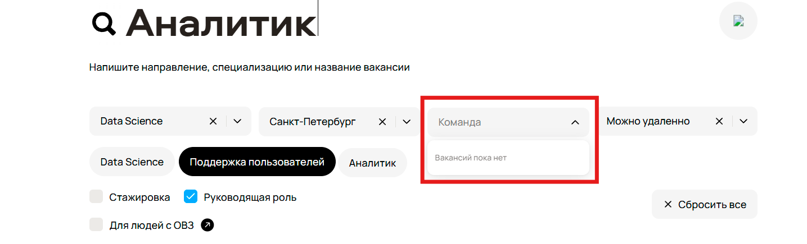

2. **Ошибка при фильтрации вакансий по городу**
   - Установлен фильтр по городу ("Санкт-Петербург"), сайт предлагает вакансии из Москвы и Самары
   - Ошибка имеет высокий приоритет, т.к. не отрабатывает основной функционал фильтрации по городам
   - 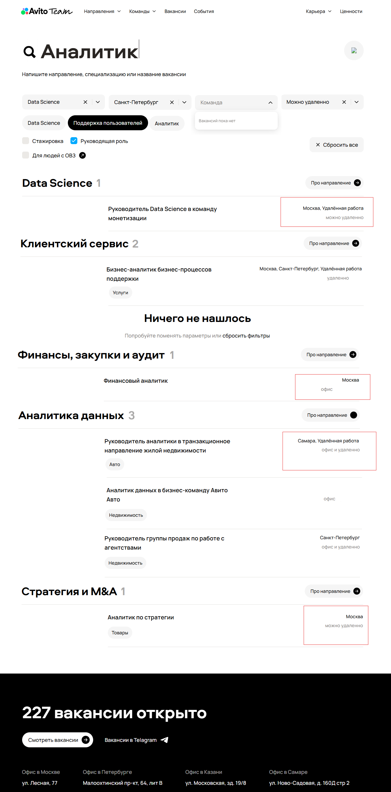

3. **Ошибка при фильтрации по руководящей роли**
   - Установлен фильтр на руководящую роль, при этом отображаются вакансии на неруководящие роли
   - Ошибка имеет высокий приоритет, т.к. не отрабатывает основной функционал фильтрации
   - 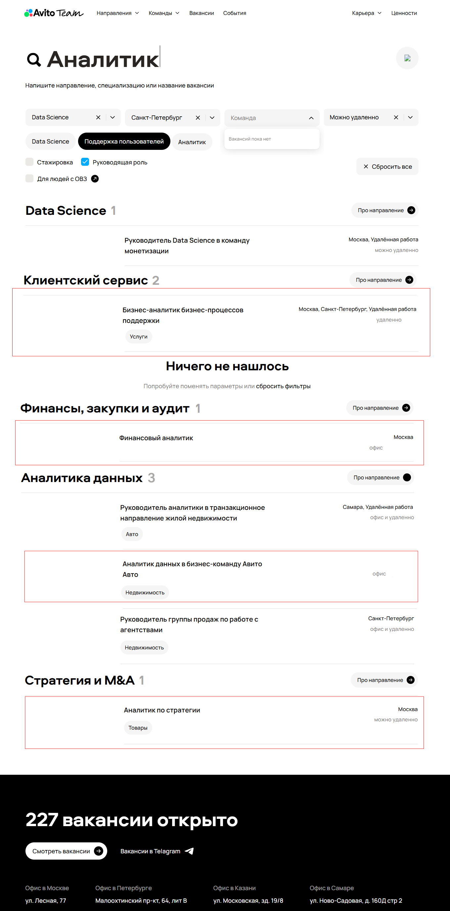

4. **Ошибочное сообщение о ненайденных вакансиях**
   - Ошибочно выводит сообщение, что вакансий не нашлось
   - Ошибка имеет высокий приоритет, т.к. вводит пользователя в заблуждение
   - 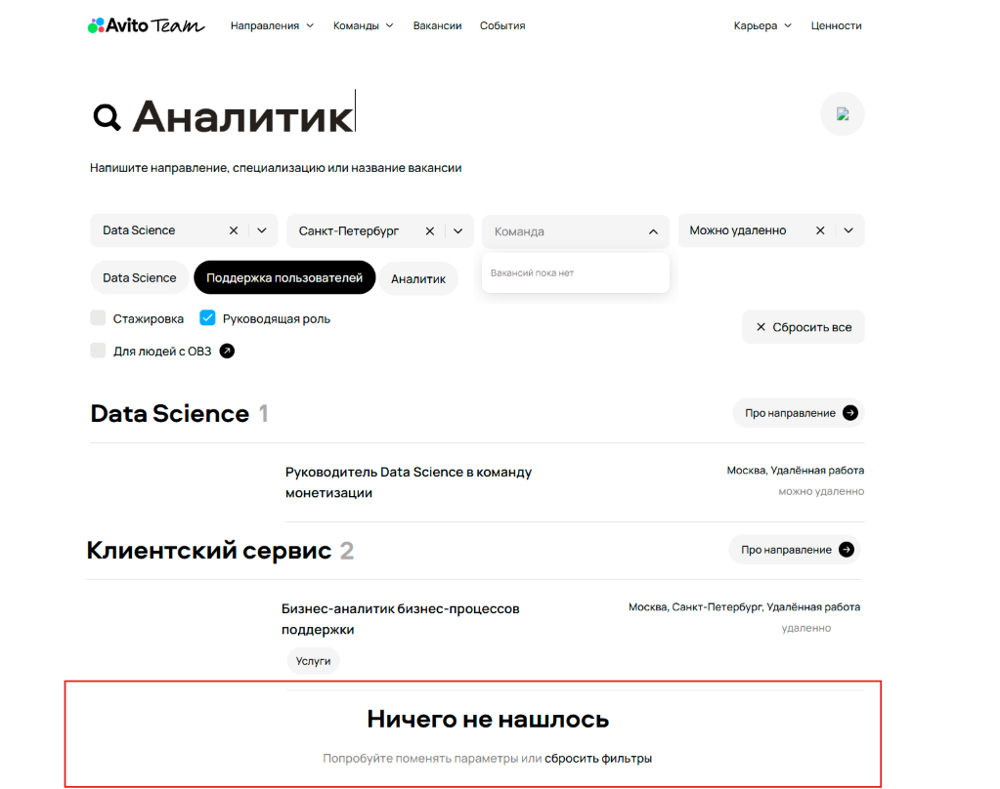

5. **Не отрабатывает фильтр по тегу "Поддержка пользователей"**
   - Сайт отображает вакансии, несвязанные с поддержкой клиентов
   - Ошибка имеет высокий приоритет, т.к. не отрабатывает фильтрация по тегам
   - 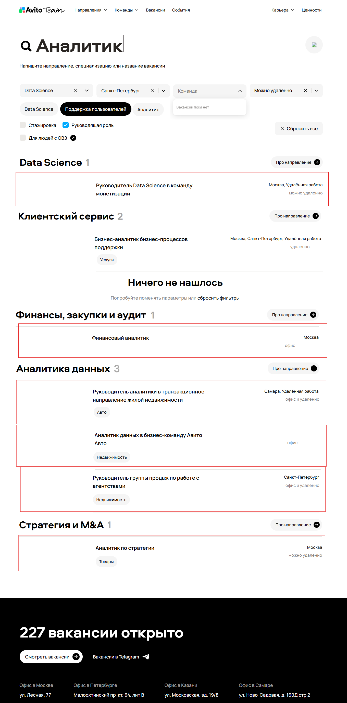

6. **Не отрабатывает фильтр по виду работы**
   - Предлагается работа в офисе, удаленно или в офисе и удаленно при установленном фильтре "Можно удаленно"
   - Ошибка имеет высокий приоритет, т.к. не отрабатывает фильтр по виду работы
   - 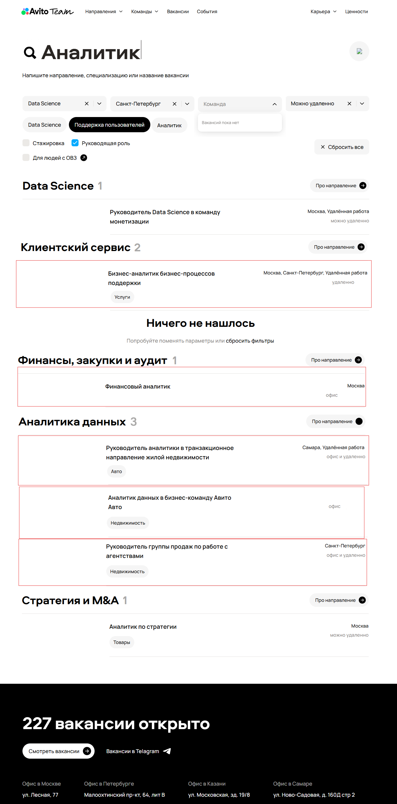

7. **Не отрабатывает поиск по ключевому слову**
   - Не отрабатывает отбор при строке поиска
   - Ошибка имеет высокий приоритет, т.к. не отрабатывает поиск по ключевому слову в направлении/специализации/вакансии
   - 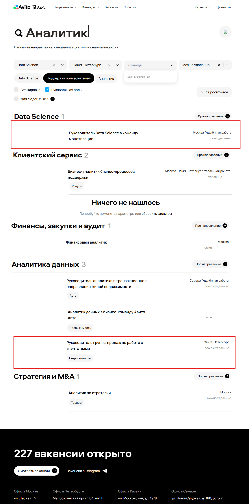

8. **Перепутаны теги у вакансий**
   - Ошибка имеет высокий приоритет, т.к. это приведет к неправильной выдаче информации
   - 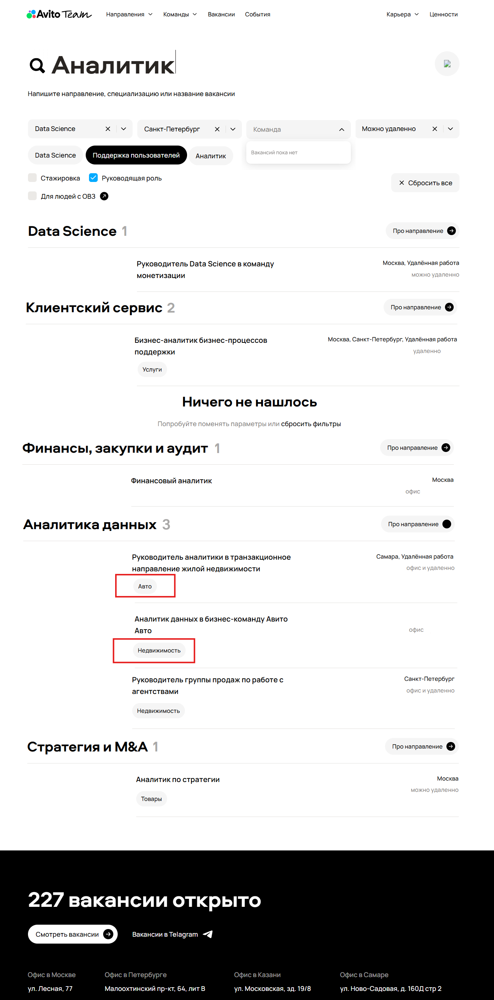

## Средний приоритет

1. **Не отображается иконка кнопки для очистки поля ввода**
   - Средний приоритет, т.к. функционал кнопки не зависит от того выводится картинка или нет, но страдает UX
   - 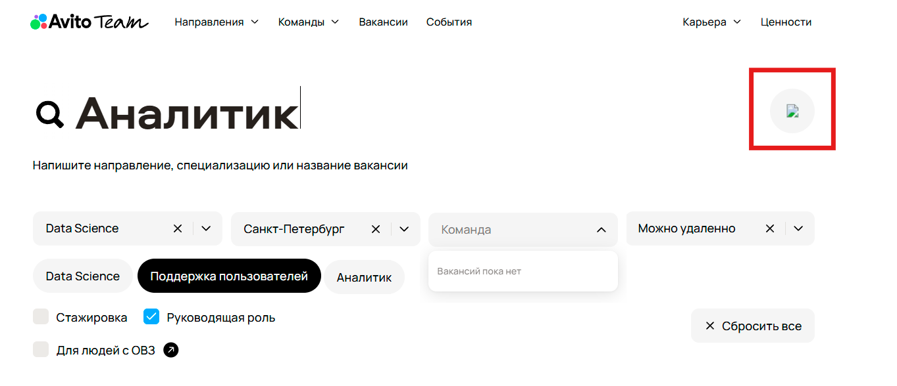

2. **Некорректный подсчет вакансий в разделе**
   - Средний приоритет, так как ошибка значительно влияет на UX, но при этом не рушит работу сайта
   - 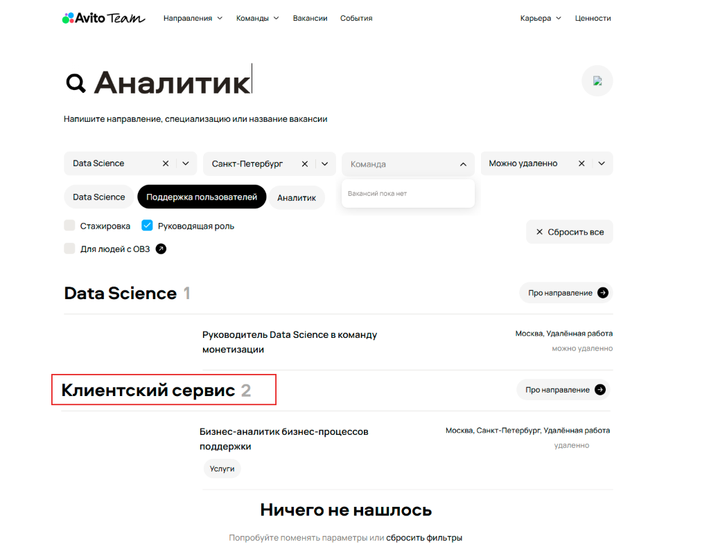

3. **Не отображается информация о городе и виде работы**
   - Средний приоритет, так как ошибка значительно влияет на UX, но при этом не рушит работу сайта
   - 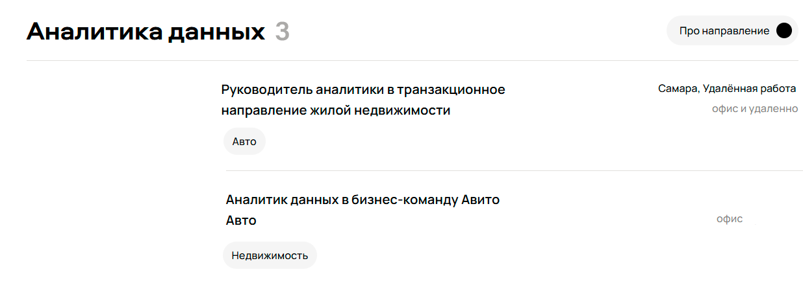

4. **Некорректный подсчет вакансий и неверный падеж**
   - "227 вакансии" → "227 вакансий"
   - Средний приоритет, так как ошибка значительно влияет на UX, но при этом не рушит работу сайта
   - 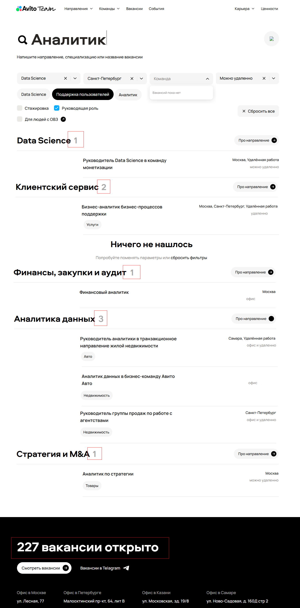

## Низкий приоритет

1. **Ошибка в выравнивании места работы**
   - Низкий приоритет, т.к. информация все равно передается пользователю, но страдает UI
   - 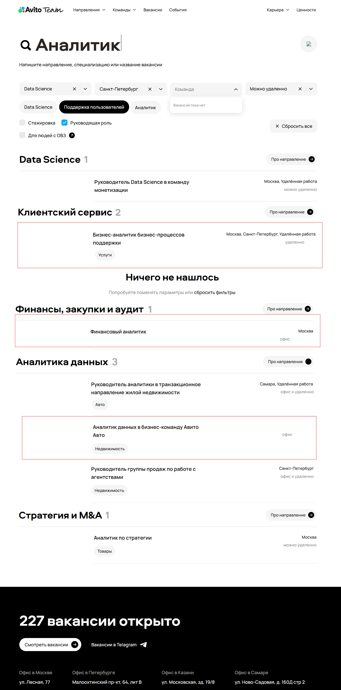

2. **Опечатка "Telagram"**
   - Низкий приоритет, т.к. большинство пользователей в первую очередь обратят внимание на иконку и поймут о чем идет речь
   - 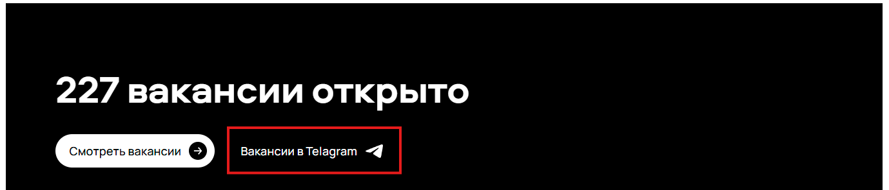

3. **Несоответствие в названии города**
   - "Офис в Петербурге" вместо полного названия
   - Низкий приоритет, т.к. во всех остальных элементах сайта указано полное название города, а здесь почему-то решили сократить, хотя необходимости в этом нет
   - 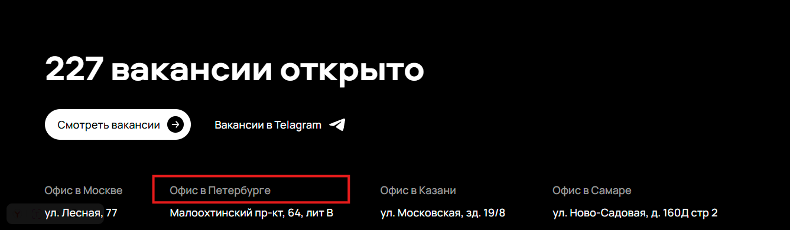

4. **Отсутствие единого формата адреса**
   - Низкий приоритет, т.к. никаких ошибок у пользователя не возникает, но при этом у разных адресов дом (строение) указано по-разному: зд., д., ' '
   - 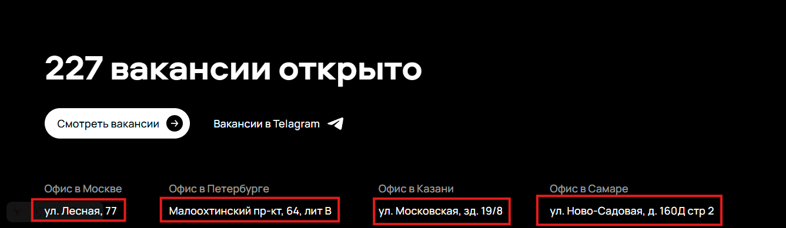

5. **Не отображается стрелочка "Про направление"**
   - Низкий приоритет, т.к. никаких ошибок у пользователя не возникает, но при этом страдает UI
   - 
